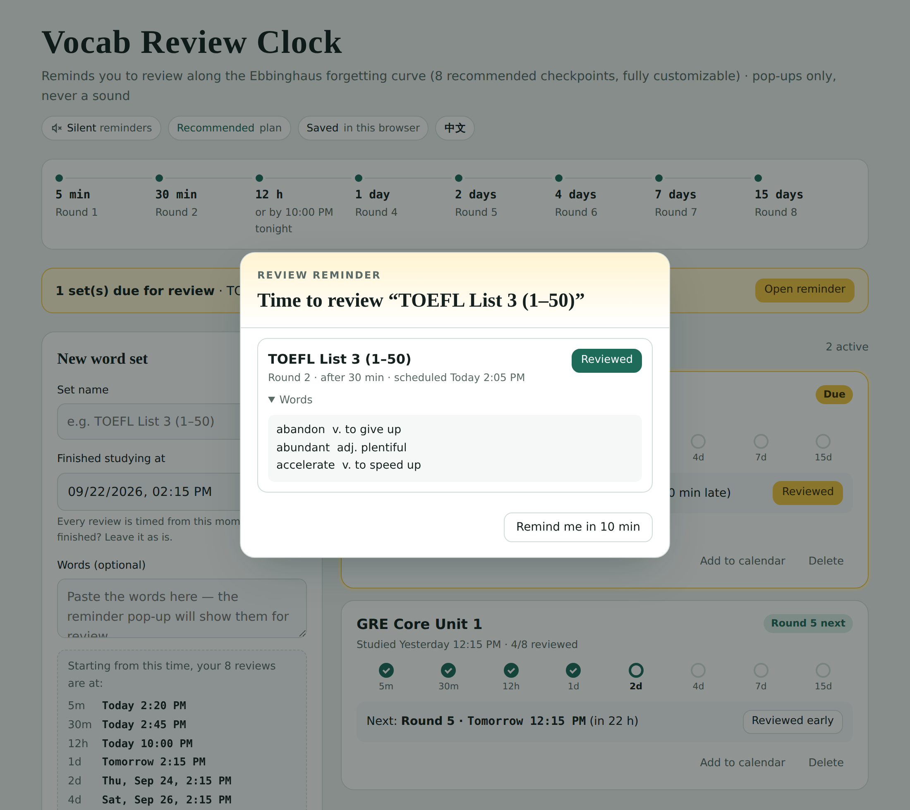

# Vocab Review Clock · 单词复习钟

**English** | [中文](README.zh-CN.md)

A silent spaced-repetition reminder for vocabulary, built around the Ebbinghaus forgetting curve. Tell it when you finished studying a word set, and it pops up a reminder at each review checkpoint: the 8 recommended ones, or your own. It shows a pop-up only and never plays a sound.

**Try it online → https://ll-code663.github.io/ebbinghaus-review-clock/**

## Review schedule

The **recommended plan** follows the Ebbinghaus forgetting curve. Every checkpoint is timed from the moment you finished studying the set:

| Round | When |
|---|---|
| 1 | 5 minutes later |
| 2 | 30 minutes later |
| 3 | 12 hours later **or by 10:00 PM tonight, whichever comes first** (the cutoff time can be changed) |
| 4 | 1 day later |
| 5 | 2 days later |
| 6 | 4 days later |
| 7 | 7 days later |
| 8 | 15 days later |

Reviewing late doesn't push back the later rounds. They always stay anchored to your original study time.

### Your own plan

Switch **Review plan** to **Custom** to set your own schedule:

- Add or remove reviews (1–20), and set each interval in minutes, hours or days.
- Any review shorter than a day can be marked **no later than tonight's cutoff**.
- Reviews are sorted by time automatically, and **Reset to recommended** brings back the default 8.
- Each set remembers the plan it was created with. Changing your plan only affects new sets; sets already in progress keep their schedule.

## Features

- **Recommended or custom schedule.** Use the Ebbinghaus plan, or pick your own number of reviews and intervals.
- **Silent by design.** Reminders appear as an in-page pop-up and a flashing tab title. You can also turn on system notifications, which are sent with `silent: true`.
- **Paste your words.** They show up inside the reminder, so you can review on the spot.
- **Snooze** a reminder for 10 minutes, or mark a round as reviewed early.
- **Catch-up.** If the page was closed, every review that came due pops up as soon as you reopen it.
- **Add to calendar.** Exports an `.ics` file with display-only alerts, so you still get reminders when the page is closed.
- **Backup and restore** your data as JSON.
- **Chinese and English UI.** It follows your browser language, and a button in the top-right corner switches between them.
- **Light and dark themes** that follow your system setting, with a layout that works on phones.
- **One file, no build step, no dependencies, no tracking.**

## How to use

There are two ways. Pick whichever you like:

1. **Online.** Open https://ll-code663.github.io/ebbinghaus-review-clock/ and bookmark it.
2. **Offline, single file.** Download [`index.html`](index.html) (click it, then use "Download raw file") and double-click it to open it in your browser. It works without internet; only the web fonts fall back to your system fonts.

Then fill in the set name and your study time, and press **Start timer**. Keep the tab open, even in the background.

> **Note:** a web page can only show reminders while it's open. If you need reminders while the browser is closed, use **Add to calendar** on a set, and set your calendar's alert sound to none.

## Privacy

Everything is stored in your browser's `localStorage`. Nothing is sent anywhere. The only network request is for Google Fonts, and the page works fine without it. Clearing your browser data erases your sets, so use **Export backup** first.

## Customizing

Everything lives in `index.html`:

- `DEFAULT_PLAN`: the recommended plan (users can also build their own in the page).
- `SNOOZE`: the snooze length.
- `I18N`: all UI text, one object per language. Add a key such as `ja` to add a language.

## Contributing

Issues and pull requests are welcome. Please keep it a single dependency-free HTML file.

## License

[MIT](LICENSE)
